<div align="center">



<a href="https://github.com/WilmerBuestan">
  
</a>


<a href="mailto:thegranwil@gmail.com"></a>

</div>

---

## `$ whoami`

<div align="center">
  
</div>

```yaml
operador:
  rango:       Capitán · Arma de Comunicaciones · Ejército del Ecuador
  especialidad: Guerra Electrónica
  formación:
    - Magíster en Ciberseguridad — UIDE (2021)
    - Ingeniería de Software (8vo semestre) — Universidad de las Fuerzas Armadas ESPE
    - Licenciado en Ciencias Militares — Universidad de las Fuerzas Armadas ESPE (2016)
  contacto:     thegranwil@gmail.com
  doctrina:     "Seguridad desde el diseño, no como parche."
```

---

## `$ cat /var/log/certificaciones.log`

| Año | Credencial | Institución | Tipo |
|:---:|---|---|:---:|
| 2021 | **Magíster en Ciberseguridad** · Reg. SENESCYT `1041-2021-2323270` | Universidad Internacional del Ecuador (UIDE) | 🎓 Posgrado |
| en curso | **Ingeniería de Software** (8vo semestre) | Universidad de las Fuerzas Armadas ESPE | 🎓 Grado |
| 2016 | **Licenciado en Ciencias Militares** · Reg. SENESCYT `1079-2016-1757728` | Universidad de las Fuerzas Armadas ESPE | 🎓 Grado |
| 2020 | Operación de aeronaves no tripuladas multirrotor con cámara térmica y RGB | Todo a Control Remoto | 🛩️ UAS |
| 2019 | Lineamientos de Políticas y Estrategias de Ciberdefensa y Ciberseguridad · 360 h | Centro Internacional de Investigación Científica en Telecomunicaciones y TIC | 🛡️ Cyber |
| 2019 | Infraestructuras Críticas, Ciberdefensa y Ciberseguridad · 360 h | Centro Internacional de Investigación Científica en Telecomunicaciones y TIC | 🛡️ Cyber |
| 2019 | Lineamientos de uso de la Información, Data y Big Data · 360 h | Centro Internacional de Investigación Científica en Telecomunicaciones y TIC | 📊 Data |
| 2019 | Derecho Internacional Humanitario: uso de la fuerza | CONADIHE | ⚖️ DIH |
| 2018 | **Curso de Analista de Guerra Electrónica** | Ejército del Ecuador | 📡 EW |
| 2016 | Suficiencia en idioma inglés | Universidad de las Fuerzas Armadas ESPE | 🌐 Idiomas |

<sub>Títulos verificables en la [consulta oficial de títulos](https://titulos-edusuperior.minedec.gob.ec/consulta-titulos-web/faces/vista/consulta/consulta.xhtml) · **Calificaciones militares:** Paracaidismo · Operaciones en Selva · Patrullas</sub>

---

## `$ cat arsenal.yaml`

<table>
<tr>
<td valign="top" width="50%">

**⌁ ciberseguridad_ofensiva_defensiva**

    

`X.509 · RSA · AES · SHA-256 · Prompt Injection defense · Rate limiting`

</td>
<td valign="top" width="50%">

**⚙ backend_y_servicios**


`Python · FastAPI · Flask · NestJS · Spring Boot · Kong · REST/SOAP`

</td>
</tr>
<tr>
<td valign="top">

**✦ frontend_y_móvil**


`React · Flutter · Dart`

</td>
<td valign="top">

**▣ datos_y_nube**


`PostgreSQL · SQLite · Firestore · Firebase · Cloud Functions`

</td>
</tr>
<tr>
<td valign="top">

**☁ infraestructura_y_devsecops**


`Docker · Linux (Kubuntu/Kali) · Bash · Git · CI/CD`

</td>
<td valign="top">

**◉ simulación_iot_y_docs**


`Unity 6 · C# · ESP32 · LaTeX`

</td>
</tr>
</table>

---

## `$ ls -la ~/operaciones`

| Estado | Operación | Descripción | Stack |
|:---:|---|---|---|
| 🟢 | [**KRATOS**](https://github.com/WilmerBuestan/Kratos_entrenador) | App para aspirantes a escuelas militares: planes de entrenamiento físico, seguimiento entrenador ↔ aspirante, rachas, métricas y notificaciones push. | Flutter · Firebase · Firestore |
| 🟢 | [**SIMTRG**](https://github.com/WilmerBuestan/fotos_gps_simtrg) | Sistema Integrado de Monitoreo Táctico y Reconocimiento Geoespacial — gestión de imágenes georreferenciadas. | — |
| 🟢 | **FirmaSegura-ESPE** | Plataforma full-stack de firma digital: certificados X.509, RSA/AES/SHA-256, JWT y sellado de PDF con código QR. | FastAPI · React |
| 🟢 | **AIGuard** | API con 7 capas de defensa DevSecOps contra Prompt Injection y SQL Injection, con dashboard de métricas (Precision, Recall, F1) en vivo. | Python · Flask · JWT · SQLite |
| 🟡 | **Parqueadero distribuido** | Gestión de parqueaderos con microservicios, API Gateway y autenticación JWT + RBAC. | NestJS · Spring Boot · Kong · PostgreSQL |
| 🟡 | **Urban War** | Simulador táctico de atención médica en combate (TCCC): patrullas NPC con FSM, NavMesh y helicópteros. | Unity 6 · C# |
| 🟡 | **Tiempo Disponible** | Calculadora de planeamiento táctico militar, en camino a artículo científico (Design Science Research). | React |

<sub>🟢 operativo · 🟡 en desarrollo</sub>

---

## `$ radar --capacidades`

<div align="center">
  
</div>

---

## `$ telemetria --github`

<div align="center">


</div>

---

## `$ snake --barrido-de-contribuciones`

<div align="center">
  
</div>

---

<div align="center">

**_"Construir software seguro para quienes protegen."_**

— CAPT. COM Wilmer Buestan · Quito, Ecuador

<sub>UNCLASSIFIED // PUBLIC PROFILE · Fin de la transmisión.</sub>

</div>
